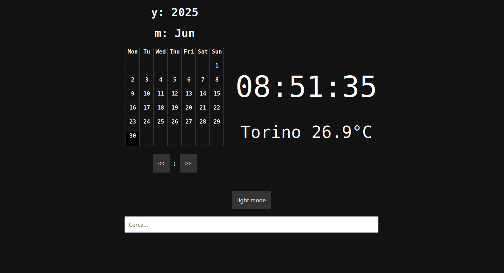

# What is Lander?

Lander is a lightweight HTML + JavaScript landing page that you can place in your /Documents/ or /Desktop/ folder. It’s designed to be used as a clean start page for your browser, perfect for replacing that boring default homepage.

# How does Lander look?

Pretty good! Here's a preview:



# Personalize

Want to see the weather for your city instead of the default? It’s easy:

- Open the Lander.js file in a text editor.

- Locate the following line of code:
 
```javascript
let city = "Torino"; //change the name of the city
```
- Replace "Torino" with the name of your city. For example:

```javascript
let city = "New York"; //change the name of the city
```
# License

This project is open source. Use it, modify it, and share it freely.
